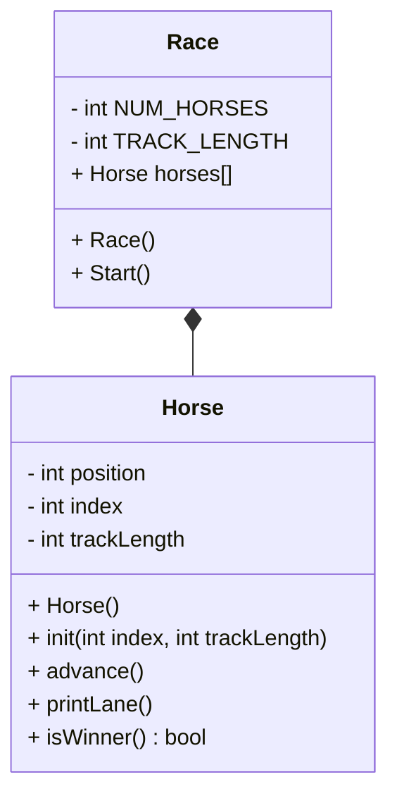

# CS121-OOP-Horse-Race-Project
## Algorithm

# OPP Horse Race 

## UML


## Race::Race()
```
const int TRACK_LENGTH
Const static int NUM_HORSES
Create an array of horses length NUM_HORSES
Initialize all the horses 
for each horse 
    initialize that horse with its index and the track length
```

### Race::start()
```
seed random 
bool keepGoing
while keepGoing: 
    go through each horse:
        advance that horse
        print that horse's lane
        if that horse won: 
            set keepGoing to false
```
### Horse::Horse()
```
position = 0 
index = 0 
trackLength = 15 
```
## void Horse::init( int index, int trackLength)
```
Horse::index = index 
Horse::trackLength = trackLength
Horse::position = 0 
```
## void Horse::advance()
```
roll a random 0-1 int, put in coin 
add coin to position --> position
```

## void Horse::printLane()
```
for pos = 0 to trackLength:
    if Horse::position == pos:
        print Horse::index 
    otherwise: 
        print '.'
print a newline at the end 
```

## bool Horse::isWinner()
```
bool win = false
if position is >= trackLength:
    win = true
    print some sort of message 
return win
```
## main() 
```
race object 
start the race 
keep the race running until horse wins 
return 0 to end the program
```


